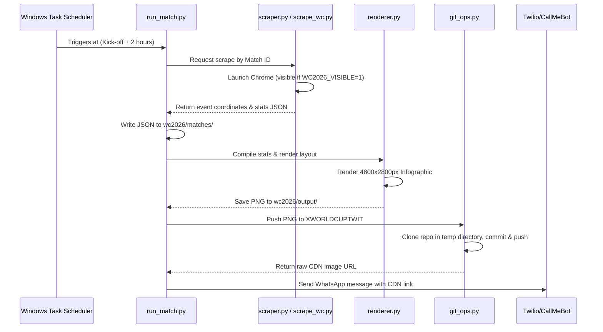

# FIFA World Cup 2026 Match Analytics – Technical Documentation

This document provides a comprehensive overview of the architecture, technical implementations, operational guidelines, and recent migration details for the FIFA World Cup 2026 Match Analytics Pipeline.

---

## 1. Migration Overview

Initially developed as a subproject inside the `BCNFINAL` repository, the World Cup 2026 analytics pipeline was migrated to the `XWORLDCUPTWIT` repository. This migration was executed to achieve the following:
* **Decoupling**: Separate tournament-specific operations, heavy asset files (e.g. high-resolution nation logos), and output artifacts from the core Barcelona analytics database and modules.
* **Targeted Automations**: Enable `XWORLDCUPTWIT` to act as a dedicated hosting repository for the automated bot, while keeping `BCNFINAL` clean and focused solely on club-level analysis.

### Migration Steps Executed:
1. All modules under `wc2026/` and crest badges under `team_logos/wc2026/` were moved to the root of the `XWORLDCUPTWIT` repository.
2. Path references inside script comments and documentation were updated to reflect the new repository name.
3. All BCNFINAL scheduled tasks were unregistered, and 85 new scheduled tasks were registered from the new directory `c:\Users\puzik\XWORLDCUPTWIT` to update their `WorkingDirectory` path.
4. Traces of `wc2026/`, `team_logos/wc2026/`, and `demo/` folders were deleted from `BCNFINAL`'s local and remote `main` branches.

---

## 2. Technical Enhancements & Solutions

### A. WhoScored Scraper & Cloudflare Bypass
WhoScored uses Cloudflare protection, which detects and blocks headless automated requests (`--headless`).
* **Visible Browser Mode**: Implemented a toggle via `WC2026_VISIBLE=1` environment variable. When set to `1`, `undetected-chromedriver` launches a visible Chrome browser. This allows the request to bypass Cloudflare security checks and successfully retrieve all match event coordinates (e.g. 1,600+ events for Argentina vs. Algeria).
* **Visible Browser Flag**: Configured in `scrape_wc.py` and `scraper.py` using:
  ```python
  visible = os.environ.get("WC2026_VISIBLE", "0") == "1"
  # Starts Chrome in normal GUI mode instead of headless
  ```

### B. Logo/Badge Aspect Ratio Preservation
Using fixed boundaries for image display often distorts logos with non-square proportions (e.g. flag vs shield shapes).
* **Dynamic Sizing**: Updated `_place_flag` in `renderer.py` to retrieve the source image dimensions using Pillow (`Image.open(path)`). It calculates the source aspect ratio and maps it dynamically against the GridSpec physical bounding box dimensions.
* **Crest Anchoring**: Centered and anchored the team crests directly next to the country name text in the header, creating a clean unified header banner:
  * **Home Team**: Name is positioned, and the crest is placed immediately to its right.
  * **Away Team**: Crest is placed first, and the name is positioned immediately to its right.

### C. Mobile-Optimization & Font Scaling
To ensure infographics are readable when posted on X/Twitter feeds or viewed on mobile devices, all text was scaled up by 25–30%:
* **Header Title**: Country names set to `35pt` and score set to `60pt`.
* **Central Stats Table**: Category names increased to `13pt`, team headers to `14pt`, and comparative values to `17pt`.
* **Pass Networks**: Pitch node labels set to `14pt` and sub-plot titles to `15pt`.
* **Shot Maps & Final Third Entries**: Section titles scaled to `14pt`–`15pt` with clear legends.

### D. Overlap Prevention & Text Buffers
In the **Final Third Entries** plot, arrows showing entry passes often crossed directly behind player labels and channel completion percentages.
* **White Background Bounding Boxes**: Added a bounding box (`bbox`) with `facecolor='white'`, `edgecolor='none'`, and `alpha=0.85` (or `0.75`) behind all channel annotation labels. This masks the background lines and entry arrows, guaranteeing text readability.

---

## 3. System Architecture & Component Flow

The pipeline executes in a linear workflow:



### Component Details:
1. **`run_match.py`**: The CLI orchestrator. It parses CLI arguments, triggers the scrapers, saves raw data, calls the renderer, and publishes the output.
2. **`scraper.py` / `scrape_wc.py`**: Fetches match lineups, metrics, and coordinate-level events. `scrape_wc.py` processes raw event coordinates, normalizes them into the custom schema, and calculates stats like possession, shots, and passes.
3. **`renderer.py`**: Consolidates coordinates and stats into a multi-panel Matplotlib canvas. It draws:
   * Two pass networks (touch-volume sized nodes and pass-link thickness).
   * A comparative stats table.
   * Two shot maps (circle markers sized by individual shot xG).
   * Attacking third entry lanes (with Left, Center, and Right completion metrics).
4. **`git_ops.py`**: Clones `XWORLDCUPTWIT` to a temporary directory, copies the output PNG to the `WorldCup2026` folder, commits the file under the user name `WC2026 Analytics Bot`, and pushes to the repository using a Personal Access Token (`GIT_TOKEN`).

---

## 4. Operation Guidelines

### Running a Scrape
To scrape and render a completed match, run:
```bash
# Force visible browser to bypass bot verification checks
$env:WC2026_VISIBLE="1"
python -m wc2026.run_match --fotmob-id [MATCH_ID]
```

### Overriding Team Crests
* Save transparent `.png` files directly inside `team_logos/wc2026/`.
* File names must exactly match the country names in the scraped JSON files (e.g. `Saudi Arabia.png`, `New Zealand.png`).
* The renderer dynamically loads these files at runtime, avoiding hardcoded dimensions.

### Managing Windows Scheduler Tasks
* Check currently registered tasks:
  ```powershell
  Get-ScheduledTask -TaskPath "\WC2026\*"
  ```
* Force-run a scheduled task for testing:
  ```powershell
  Start-ScheduledTask -TaskName "WC2026_[MatchID]_[Home]_vs_[Away]"
  ```
* Task Scheduler logs its run results; standard output/error files are written as `*.log` inside `wc2026/`.
