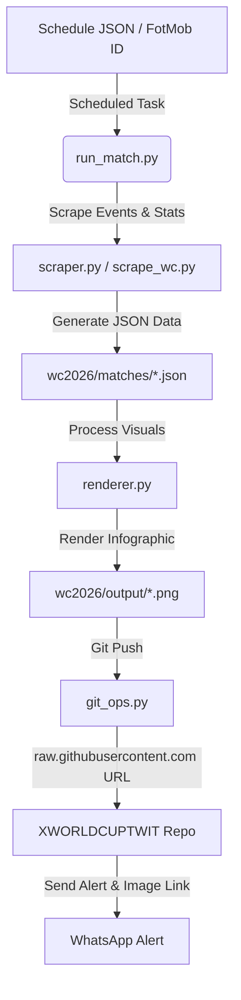

# 🏆 FIFA World Cup 2026 – Match Analytics Pipeline & Infographics

An automated end-to-end data pipeline that scrapes event-level match data, renders professional-grade high-resolution infographics (sized for X/Twitter posts), archives the graphics to a public Git repository, and notifies match analysts via WhatsApp.

---

## 📂 System Architecture

The subproject is organized as follows:



### 🧬 Core Components

1.  **Orchestrator CLI (`run_match.py`)**:
    *   The single-match command-line entry point. Runs start-to-finish: scrapes match metrics, invokes the renderer, pushes the generated graphic to GitHub, and triggers WhatsApp alerts.
2.  **Match Scraper (`scraper.py` / `scrape_wc.py`)**:
    *   Acquires match lineups, stats, event coordinates (passes, shots, etc.) from WhoScored/FotMob.
    *   Caches raw data into `wc2026/matches/[Date]_[Home]_vs_[Away].json`.
3.  **Analytics Renderer (`renderer.py`)**:
    *   Uses `matplotlib` and `mplsoccer` to compile event data into a high-res **24" × 14" (4800 × 2800 px)** white-canvas infographic.
4.  **Git Publisher (`git_ops.py`)**:
    *   Clones and commits the generated graphic to a secondary media-hosting repository (`XWORLDCUPTWIT`) for hosting.
5.  **Task Scheduler (`register_tasks.ps1` / `unregister_tasks.ps1`)**:
    *   Reads the tournament schedule (`REMAINING_SCHEDULE.json`) and registers single-run Windows Scheduled Tasks configured to fire precisely at (kick-off time + 2 hours).

---

## 🎨 Visual Layout & Features

The infographic is structured into a 3-column, 3-row grid:

*   **Header Section**:
    *   Displays match metadata (stage, group, stadium, location) with automatic formatting that suppresses leading commas for missing cities.
    *   Maintains the original, unstretched aspect ratio of team badges/crests dynamically.
    *   Crests are anchored directly next to the country names for a clean unified team banner.
*   **Row 1 (Middle Row)**:
    *   **Home & Away Pass Networks**: Shows player average positions (sized by touch volume) and pass-link thickness scaled by pass volume thresholds.
    *   **Zebra-Striped Central Stats Table**: Displays 9 critical comparative stats (xG, possession, shot accuracy, big chances, pass percentages, duels, saves, and fouls) in bold high-contrast text.
*   **Row 2 (Bottom Row)**:
    *   **Home & Away Shot Maps**: Attacking half-pitch maps. Goals are colored filled circles, and misses are wireframes. Node size scales directly with individual shot xG.
    *   **Final Third Entries Map**: A full horizontal pitch split down the middle. Highlights entries into the attacking third with channel summaries (Left Wing, Center, Right Wing) and overall completion percentages enclosed in transparent background bboxes to eliminate visual arrow overlap.

---

## ⚙️ Installation & Setup

### 1. Prerequisites
Ensure you have Python 3.10+ installed. Install the dependencies for this subproject:
```bash
pip install -r wc2026/requirements.txt
```

### 2. Environment Variables (`.env`)
Create a `.env` file at the root of the repository. You can copy the contents of `wc2026/.env.template` as a starting point. Key configuration values include:

```env
# Personal Access Token with repo write permissions for media hosting
GIT_TOKEN=ghp_xxxxxxxxxxxxxxxxxxxxxxxxxxxxx
XWORLDCUPTWIT_REPO=https://github.com/RShiri/XWORLDCUPTWIT.git

# WhatsApp Alert Provider (twilio or callmebot)
WHATSAPP_PROVIDER=callmebot
WHATSAPP_PHONE=+1234567890
WHATSAPP_CALLMEBOT_KEY=xxxxxx
```

---

## 🚀 Usage Guide

### Running a Match Manually
You can run the one-shot pipeline manually using a FotMob Match ID or by providing a pre-scraped JSON file:

```bash
# Option A: Scrape a live/finished match from FotMob ID
py -m wc2026.run_match --fotmob-id 4667812

# Option B: Run from an existing scraped JSON file (skips scraping)
py -m wc2026.run_match --from-file wc2026/matches/2026_06_16_Iraq_vs_Norway.json

# Option C: Render and upload, but skip WhatsApp alerts
py -m wc2026.run_match --fotmob-id 4667812 --no-post

# Option D: Render local PNG, but skip Git pushing
py -m wc2026.run_match --fotmob-id 4667812 --no-push
```

### Automating the Schedule via Windows Task Scheduler
To schedule all remaining matches of the tournament automatically:

```powershell
# Bypass execution policy and register all remaining schedule tasks
powershell -ExecutionPolicy Bypass -File wc2026\register_tasks.ps1

# Register only the matches scheduled within the next 7 days
powershell -ExecutionPolicy Bypass -File wc2026\register_tasks.ps1 -DaysAhead 7

# Perform a dry-run to see what tasks would be created
powershell -ExecutionPolicy Bypass -File wc2026\register_tasks.ps1 -WhatIf

# Unregister and clean up all WC2026 tasks
powershell -ExecutionPolicy Bypass -File wc2026\unregister_tasks.ps1
```

---

## 🛡️ Asset Override (Badges & Crests)
All crests/flags downloaded for the tournament are stored in:
`team_logos/wc2026/`

To manually override a flag or crest with a custom graphic (e.g. replacing default national flags with association crests), save a transparent `.png` image named exactly as the team name (e.g. `Portugal.png`) into that directory. The renderer will automatically load and scale it during the next run.
